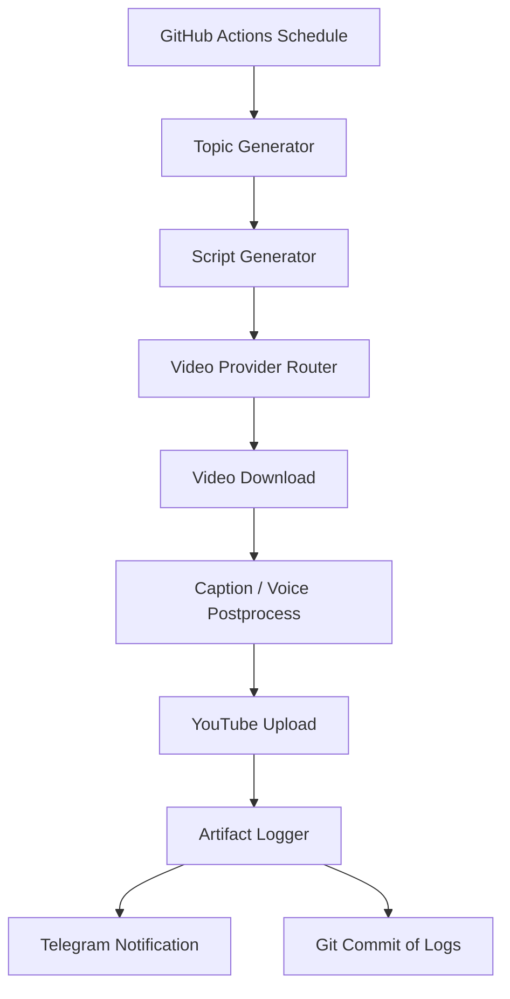

# AI Shorts Factory — Engineering Specification
**Version:** 1.0  
**Status:** Draft for implementation with Codex  
**Primary target:** One automated Hindi YouTube Short per day  
**Operating constraint:** No dependency on a personal laptop being online at generation time

---

## 0. Purpose of this document

This document is the single source of truth for an automated AI content pipeline that:
1. Generates one Hindi Shorts topic every day.
2. Writes a 15–20 second script.
3. Generates a vertical AI video.
4. Applies captions and voice if needed.
5. Uploads to YouTube automatically.
6. Logs every step.
7. Notifies the owner on success or failure.
8. Produces a monthly performance report and uses analytics to improve future prompts.

This document is written to be consumed by an AI coding agent. It is intentionally explicit about model selection, fallback ordering, file layout, logging, and failure handling so the implementation can be deterministic.

---

## 1. Product goals

### 1.1 Core goal
Create a system that reliably publishes **one YouTube Short per day** with minimal manual intervention.

### 1.2 Content format
- Language: **Hindi**
- Video length: **15–20 seconds**
- Aspect ratio: **9:16**
- Target style: simple, visually engaging, short hook, no long outro
- Output location: YouTube Shorts channel

### 1.3 Success criteria
The project is considered successful when all of the following are true:
- One upload is produced daily without manual laptop involvement.
- Every run leaves a durable log record.
- The owner gets a notification after each run.
- The pipeline can recover from a provider failure by switching to the next provider.
- The system can run for 30 consecutive days with no missing logs.

### 1.4 Non-goals for v1
- No multi-language publishing in v1.
- No multi-channel publishing in v1.
- No advanced thumbnail A/B testing in v1.
- No complex dashboard in v1.
- No local GPU video generation in v1.
- No attempt to bypass provider rate limits or quota rules.

---

## 2. Design principles

1. **Cloud-first** — the daily pipeline should run on cloud automation, not on the owner’s laptop.
2. **Provider-agnostic** — every AI provider is accessed through a narrow interface so it can be swapped later.
3. **Fail forward** — if a provider fails or quota is exhausted, the system moves to the next allowed provider.
4. **Log everything** — every action writes a machine-readable log.
5. **Prefer official APIs** — use browser automation only when an API is unavailable and the service terms allow it.
6. **One responsibility per module** — avoid large monolithic scripts.
7. **Deterministic state** — all run artifacts are stored and referenced by IDs.
8. **Simple first** — the daily pipeline should be the minimal useful version before adding analytics or optimization loops.

---

## 3. Final recommended provider stack

The following stack is the **default** implementation choice for v1.

### 3.1 Text / idea / script generation
Use these providers in this exact order:

1. **Groq — Qwen3-32B**
2. **NVIDIA NIM — DeepSeek-R1**
3. **Google Gemini — Gemini 2.5 Flash**

#### Rationale
- **Groq Qwen3-32B** is the preferred fast daily model for short idea generation and script drafting.
- **NVIDIA NIM DeepSeek-R1** is the preferred reasoning fallback when better planning or stronger structure is needed.
- **Gemini 2.5 Flash** is the final fallback because it is strong, fast, and reliable for short-form generation.

#### Output format
The script generator must return a strict JSON object with:
- topic
- hook
- script
- title
- description
- hashtags
- visual_prompt
- voice_prompt
- safety_notes
- estimated_seconds

### 3.2 Video generation
Use these providers in this exact order:

1. **Google Flow — Veo 3.1 Fast**
2. **Qwen Studio — Wan 2.7 Text-to-Video**
3. **Dreamina — Seedance 2.5**
4. **Google Flow — Veo 3.1 Lite**

#### Rationale
- **Veo 3.1 Fast** is the best primary balance of quality and quota efficiency for a daily Short.
- **Wan 2.7** is the fallback if Qwen access is available for the chosen workflow.
- **Seedance 2.5** is the fallback when Dreamina access is available and the system needs a different generator.
- **Veo 3.1 Lite** is the emergency fallback to preserve the daily posting habit.

#### Important policy note
The pipeline must **not** attempt to evade quota or pricing rules. It may only:
- use remaining allowed credits,
- switch to another provider,
- or skip generation and log a failure if no provider is available.

### 3.3 Voice generation
For v1, the pipeline should prefer **native video audio** when available from the selected video provider. If the selected video provider does not reliably synthesize usable voice or if the script needs a separate voiceover, then use:

1. **Google TTS** if available in the selected environment
2. **Edge TTS**
3. **Piper** as a fully local fallback

In v1, voice generation is optional if the chosen video provider already produces satisfactory spoken Hindi audio.

### 3.4 Captions
Use **Whisper** or **Whisper.cpp** for captions if the video does not already contain suitable subtitles and if burned-in captions are needed.

### 3.5 Upload
Use the official **YouTube Data API**.

### 3.6 Notifications
Use **Telegram Bot API**.

### 3.7 Analytics
Use **YouTube Analytics API** once monthly.

---

## 4. Provider-specific decision rules

### 4.1 Text generation decision rules
The daily script job should follow this flow:

1. Generate a topic using Groq Qwen3-32B.
2. If Groq fails or returns invalid JSON, retry once.
3. If still invalid, use NVIDIA NIM DeepSeek-R1.
4. If that fails, use Gemini 2.5 Flash.
5. If all fail, mark the daily run as failed and notify the owner.

### 4.2 Video generation decision rules
The video generator must attempt exactly one provider at a time and never parallelize paid generations for the same run.

1. Try Veo 3.1 Fast.
2. If unavailable, quota exhausted, or task rejected, fall back to Wan 2.7.
3. If Wan 2.7 is unavailable or unusable, fall back to Seedance 2.5.
4. If Seedance 2.5 is unavailable, use Veo 3.1 Lite.
5. If no provider succeeds, stop and send a failure notification.

### 4.3 Quality preference
For v1, consistency matters more than perfection. A shorter, slightly weaker video is acceptable if it preserves daily publication.

---

## 5. Content strategy

### 5.1 Primary niche
The first channel should focus on **Hindi health and body-explainer Shorts**.

### 5.2 Content pillars
Use a fixed set of recurring content pillars:
- Sleep
- Tea and coffee
- Sugar
- Liver
- Brain
- Heart
- Gut
- Exercise
- Hydration
- Daily habits

### 5.3 Recommended style
The best-performing v1 style should be:
- A fast hook in the first 1–2 seconds
- One visual metaphor or body-centered scene
- One simple explanation
- No long outro
- A short closing line only if it helps retention

### 5.4 Content safety
The system should avoid:
- making unsupported medical claims,
- presenting personal health advice as diagnosis,
- using sensational falsehoods,
- using copyrighted characters or assets unless the provider explicitly permits them.

### 5.5 Prompting style
The script prompt should instruct the model to:
- write in Hindi,
- keep it short,
- make it easy to visualize,
- keep the language conversational,
- produce a clear ending,
- avoid medical certainty when evidence is weak.

---

## 6. System architecture



### 6.1 High-level components
- **Scheduler**
- **Orchestrator**
- **Provider router**
- **Artifact store**
- **Uploader**
- **Logger**
- **Notifier**
- **Analytics processor**

### 6.2 Why this structure
This structure keeps each concern isolated:
- Scheduling does not know how video is generated.
- Video generation does not know how YouTube upload works.
- Logging does not know which provider was used.
- Analytics does not change the daily pipeline.

---

## 7. Runtime flow

### 7.1 Daily run
At the scheduled time:
1. Create a new `run_id`.
2. Load configuration and secrets.
3. Generate topic JSON.
4. Generate script JSON.
5. Request video generation using the provider router.
6. Download the resulting MP4.
7. If needed, generate captions.
8. Upload to YouTube.
9. Save metadata and logs.
10. Commit daily logs back to GitHub.
11. Send Telegram success/failure notification.

### 7.2 Required behavior on failure
If any step fails:
- Write a failure log immediately.
- Preserve partial artifacts.
- Attempt the next fallback provider only if the failure is provider-specific and recoverable.
- Notify the owner with the failed step and the reason.

---

## 8. Exact models and roles

### 8.1 Daily topic model
Primary:
- **Groq — Qwen3-32B**

Fallback:
- **NVIDIA NIM — DeepSeek-R1**

Final fallback:
- **Gemini 2.5 Flash**

### 8.2 Script writing model
Use the same model chain as the topic generator, but with a stronger output contract:
- exactly one script,
- exactly one title,
- exactly one video prompt,
- exactly one metadata block.

### 8.3 Monthly analysis model ensemble
The monthly report should use a judge ensemble:
1. **Gemini 2.5 Flash**
2. **NVIDIA NIM — DeepSeek-R1**
3. **Groq — Qwen3-32B**

The monthly judge should:
- compare topic performance,
- find repeating patterns,
- identify best hooks,
- recommend content pillars for next month,
- suggest prompt revisions.

### 8.4 Video model priority
1. **Veo 3.1 Fast**
2. **Wan 2.7 Text-to-Video**
3. **Seedance 2.5**
4. **Veo 3.1 Lite**

---

## 9. Exact output contracts

### 9.1 Topic JSON
```json
{
  "run_id": "2026-07-13T08:00:00+05:30",
  "language": "hi",
  "pillar": "sleep",
  "topic": "अगर आप देर रात तक फोन देखते हैं तो दिमाग के साथ क्या होता है?",
  "hook": "आपका दिमाग अभी भी सो रहा है, लेकिन आप उसे स्क्रीन से जगा रहे हैं.",
  "estimated_seconds": 18
}
```

### 9.2 Script JSON
```json
{
  "topic": "...",
  "title": "...",
  "script": "...",
  "visual_prompt": "...",
  "voice_prompt": "...",
  "hashtags": ["#shorts", "#hindi", "#health"],
  "estimated_seconds": 18,
  "safety_notes": ["No unsupported medical claims"]
}
```

### 9.3 Run log JSON
```json
{
  "run_id": "2026-07-13T08:00:00+05:30",
  "date": "2026-07-13",
  "status": "uploaded",
  "topic": "...",
  "provider": "veo_3_1_fast",
  "video_model": "Veo 3.1 Fast",
  "youtube_url": "https://youtube.com/...",
  "duration_seconds": 18,
  "generation_seconds": 212,
  "error": null
}
```

---

## 10. Repository structure

```text
shorts-factory/
├── .github/
│   └── workflows/
│       ├── daily.yml
│       ├── monthly.yml
│       └── manual.yml
├── app/
│   ├── main.py
│   ├── orchestrator.py
│   ├── config.py
│   ├── types.py
│   ├── exceptions.py
│   ├── providers/
│   │   ├── __init__.py
│   │   ├── base.py
│   │   ├── groq_provider.py
│   │   ├── nvidia_provider.py
│   │   ├── gemini_provider.py
│   │   ├── veo_provider.py
│   │   ├── qwen_provider.py
│   │   ├── dreamina_provider.py
│   │   ├── whisper_provider.py
│   │   ├── youtube_provider.py
│   │   └── telegram_provider.py
│   ├── prompts/
│   │   ├── topic_prompt.txt
│   │   ├── script_prompt.txt
│   │   ├── video_prompt.txt
│   │   ├── monthly_judge_prompt.txt
│   │   └── metadata_prompt.txt
│   ├── logging/
│   │   ├── logger.py
│   │   ├── schema.py
│   │   └── commit_log.py
│   ├── storage/
│   │   ├── sqlite.py
│   │   ├── models.py
│   │   └── migrations/
│   ├── notifications/
│   │   └── telegram.py
│   ├── analytics/
│   │   ├── collect.py
│   │   ├── judge.py
│   │   └── report.py
│   └── utils/
│       ├── retry.py
│       ├── files.py
│       ├── jsonschema.py
│       └── time.py
├── data/
│   ├── ideas/
│   ├── runs/
│   ├── videos/
│   ├── captions/
│   └── reports/
├── docs/
├── tests/
└── requirements.txt
```

---

## 11. Configuration and secrets

### 11.1 Environment variables
The implementation must read configuration from environment variables only.

Required:
- `GROQ_API_KEY`
- `NVIDIA_API_KEY`
- `GEMINI_API_KEY`
- `YOUTUBE_CLIENT_SECRET_JSON`
- `YOUTUBE_REFRESH_TOKEN`
- `TELEGRAM_BOT_TOKEN`
- `TELEGRAM_CHAT_ID`
- `GITHUB_TOKEN`
- `RUN_TIMEZONE=Asia/Kolkata`

Optional:
- `QWEN_API_KEY`
- `DREAMINA_API_KEY`
- `WHISPER_MODEL_SIZE`
- `DEFAULT_LANGUAGE=hi`
- `DEFAULT_PROVIDER_POLICY=primary_only|fallback_allowed`

### 11.2 Secret handling rules
- Never hardcode secrets.
- Never print secrets to logs.
- Mask secret values in debug output.
- Ensure that GitHub Actions secrets are accessed only through environment variables.

---

## 12. Provider abstraction layer

### 12.1 Base interface
Every provider must implement a consistent interface.

```python
class Provider(Protocol):
    name: str

    def health_check(self) -> ProviderHealth: ...
    def generate(self, request: ProviderRequest) -> ProviderResponse: ...
```

### 12.2 Video provider interface
```python
class VideoProvider(Protocol):
    name: str

    def can_accept(self, request: VideoRequest) -> bool: ...
    def create_job(self, request: VideoRequest) -> VideoJob: ...
    def poll_job(self, job_id: str) -> VideoJobStatus: ...
    def download_result(self, job_id: str, target_path: Path) -> Path: ...
```

### 12.3 Text provider interface
```python
class TextProvider(Protocol):
    name: str

    def generate_json(self, prompt: str, schema: dict) -> dict: ...
```

### 12.4 Notification provider interface
```python
class Notifier(Protocol):
    def send(self, message: str, attachment: Optional[Path] = None) -> None: ...
```

---

## 13. Retry and fallback policy

### 13.1 Retry categories
Only retry:
- network timeouts,
- temporary 5xx failures,
- transient provider unavailability,
- polling delays.

Do not retry:
- invalid credentials,
- malformed requests,
- quota exhaustion after confirmed exhaustion,
- policy rejection that is unlikely to succeed on retry.

### 13.2 Backoff policy
Use exponential backoff with jitter:
- first retry after 5 seconds,
- second retry after 15 seconds,
- third retry after 45 seconds.

### 13.3 Fallback policy
If a provider is exhausted or unavailable:
- mark it as unavailable for this run,
- move to the next provider,
- preserve the original error in the log.

---

## 14. Logging system

### 14.1 Logging requirement
Logging is mandatory.

### 14.2 Log levels
- DEBUG
- INFO
- WARNING
- ERROR
- CRITICAL

### 14.3 Log destinations
- stdout for live workflow logs
- JSON run files for durable logs
- SQLite for queryable state
- Git repository for versioned daily artifacts

### 14.4 Log content
Each run should record:
- run_id
- timestamp
- provider chosen
- model chosen
- topic
- title
- script hash
- video hash
- upload result
- YouTube URL
- failure step, if any
- error text, if any
- duration
- retry count

### 14.5 Git commit behavior
The daily workflow must commit:
- logs
- metadata
- reports

This commit should be automatic and should not require the owner’s laptop.

---

## 15. Notification design

### 15.1 Why Telegram
Telegram is the default notifier because it is simple, fast, and easy to check from a phone.

### 15.2 Success message
The success notification should include:
- status
- title
- provider
- model
- YouTube URL
- run duration

### 15.3 Failure message
The failure notification should include:
- failed step
- provider
- error summary
- next fallback attempted
- whether the run was abandoned or recovered

### 15.4 Attachment behavior
If possible, include:
- thumbnail
- log file
- short summary text

---

## 16. YouTube upload design

### 16.1 API choice
Use the official YouTube Data API.

### 16.2 Required actions
- upload video
- set title
- set description
- set tags
- set category
- set privacy status
- optionally schedule publish time
- optionally attach thumbnail

### 16.3 Metadata rules
The uploader must write:
- `#shorts`
- language-specific metadata
- concise title
- description with minimal spam
- tags relevant to the topic

### 16.4 Upload failure handling
If upload fails:
- retry with backoff only for transient failures
- do not re-upload blindly after a confirmed successful upload
- store the upload identifier and response body

---

## 17. Captions and voice

### 17.1 Native audio preference
If the chosen video provider generates usable Hindi speech and the output is synchronized, use that audio.

### 17.2 External voice fallback
If native audio is not sufficient:
1. Use a free or already-available TTS option.
2. Burn captions using Whisper or Whisper.cpp.

### 17.3 Subtitle format
Generate:
- `.srt`
- `.vtt`
- optional burned-in captions for Shorts

---

## 18. Database design

### 18.1 SQLite as the default database
Use SQLite because:
- it is file-based,
- it is simple,
- it works well for a daily pipeline,
- it does not require server administration.

### 18.2 Core tables

#### runs
Stores each daily execution.

Fields:
- run_id
- date
- status
- provider
- model
- topic
- title
- youtube_url
- error
- created_at
- updated_at

#### artifacts
Stores generated files and their locations.

Fields:
- artifact_id
- run_id
- artifact_type
- local_path
- checksum
- created_at

#### analytics
Stores monthly analytics snapshots.

Fields:
- month
- views
- impressions
- ctr
- avg_view_duration
- likes
- comments
- shares
- best_topic
- best_hook
- judge_summary

#### provider_health
Stores provider availability and recent failures.

Fields:
- provider_name
- status
- last_checked_at
- last_success_at
- last_error

---

## 19. Monthly analytics and judge system

### 19.1 Monthly goal
At the end of each month, analyze the previous month and generate recommendations for the next month.

### 19.2 Inputs
- YouTube analytics
- run logs
- topic list
- script list
- provider success/failure data

### 19.3 Judge ensemble
Use a three-model ensemble:
1. Gemini 2.5 Flash
2. NVIDIA NIM DeepSeek-R1
3. Groq Qwen3-32B

### 19.4 Judge responsibilities
The judge ensemble should:
- rank topics by performance,
- identify strongest hooks,
- identify weak openings,
- identify retention loss patterns,
- recommend next month’s content pillars,
- recommend prompt changes,
- recommend provider strategy.

### 19.5 Judge output
The final monthly report must include:
- summary score
- top 10 videos
- bottom 10 videos
- recurring patterns
- topic recommendations
- prompt revisions
- next month backlog suggestions

---

## 20. Prompt library

### 20.1 Topic prompt
The topic prompt must produce:
- one topic,
- one hook,
- one content pillar,
- one expected emotional angle,
- one estimated duration.

### 20.2 Script prompt
The script prompt must produce:
- one short Hindi script,
- simple spoken language,
- clear hook,
- clear visual direction,
- no filler.

### 20.3 Video prompt
The video prompt must include:
- scene description,
- camera style,
- subject motion,
- mood,
- aspect ratio,
- duration,
- audio requirements if any.

### 20.4 Monthly judge prompt
The judge prompt must include:
- the analytics table,
- the run logs,
- the goal,
- the output schema.

---

## 21. GitHub Actions

### 21.1 Daily workflow
The daily workflow should:
- run on schedule,
- execute the orchestrator,
- upload artifacts,
- commit logs,
- send notification.

### 21.2 Monthly workflow
The monthly workflow should:
- run on the last day of the month,
- fetch analytics,
- run the judge ensemble,
- write the monthly report,
- commit the report.

### 21.3 Manual workflow
The manual workflow should allow:
- immediate execution,
- test runs,
- provider health checks,
- ad hoc reruns.

### 21.4 Important behavior
The workflow must not depend on a local laptop. It must run even if the owner is traveling or offline.

---

## 22. Testing strategy

### 22.1 Unit tests
Cover:
- JSON schema validation
- provider selection
- retry behavior
- notification formatting
- upload metadata formatting
- log writing

### 22.2 Integration tests
Cover:
- mock provider generation
- mock upload
- mock notification
- SQLite persistence
- Git commit behavior

### 22.3 End-to-end tests
Cover:
- one complete fake run,
- one provider failure fallback run,
- one upload failure run,
- one notification success run.

### 22.4 Acceptance tests
The following must pass before v1 is considered complete:
- daily run can execute end to end,
- logs are created,
- notification is sent,
- uploaded URL is stored,
- fallback works.

---

## 23. Deployment guide

### 23.1 Preferred deployment target
GitHub Actions is the default runtime for v1.

### 23.2 Deployment steps
1. Create repository.
2. Add secrets.
3. Add workflows.
4. Add provider code.
5. Add tests.
6. Add logger.
7. Add notifier.
8. Run manual test.
9. Enable daily schedule.

### 23.3 Recovery steps
If the workflow fails:
- inspect GitHub Action logs,
- inspect saved JSON logs,
- inspect provider health state,
- rerun manually after correction.

---

## 24. Engineering standards

### 24.1 Language
Python 3.11+.

### 24.2 Style
- Type hints required
- Structured logging required
- Small functions
- No giant scripts
- Dataclasses or Pydantic for structured objects
- Explicit error classes

### 24.3 Formatting
- `ruff` or equivalent linting
- `black` or equivalent formatting
- `pytest` for tests

### 24.4 Code organization
Every module must have one responsibility.

---

## 25. Security and compliance

### 25.1 Secret handling
- Use GitHub Secrets.
- Use environment variables only at runtime.
- Never write secrets to logs.

### 25.2 Content policy
Do not generate disallowed content.
Do not intentionally bypass provider restrictions.
Do not use copyrighted characters unless the provider terms allow it and the use is compliant.

### 25.3 Data policy
Store only the minimum information needed for the system to function and for analytics.

---

## 26. Implementation milestones

### Milestone 1
Repository, config, logging, tests.

### Milestone 2
Daily topic + script generation.

### Milestone 3
Video provider abstraction and first provider integration.

### Milestone 4
YouTube upload.

### Milestone 5
Telegram notifications.

### Milestone 6
Monthly analytics and report.

### Milestone 7
Optimization loop and prompt refinement.

---

## 27. Explicit implementation instructions for Codex

Codex should implement the system in this order:

1. Create project structure.
2. Implement core types and exceptions.
3. Implement config loading.
4. Implement logger.
5. Implement provider interfaces.
6. Implement topic generator.
7. Implement script generator.
8. Implement video provider router.
9. Implement YouTube uploader.
10. Implement Telegram notifier.
11. Implement SQLite persistence.
12. Implement GitHub Actions workflows.
13. Add tests.
14. Add monthly analytics job.
15. Add judge ensemble.
16. Add documentation.

Codex should not skip directly to the final workflow without the intermediate abstractions.

---

## 28. Operational notes

- One good video per day is better than no video.
- Consistency matters more than perfection.
- The system should prefer reliability over maximum model quality.
- The first month should focus on proving that the pipeline runs daily.
- After the first month, tune for retention and CTR.

---

## 29. Source notes for current platform behavior

The implementation should assume the following current platform behavior, verified from official documentation where available:
- Google Flow credits are specifically for Veo 3.1 Lite, Fast, and Quality generations.
- NVIDIA NIM containers can be accessed through the NVIDIA Developer Program.
- Qwen Studio exists as the official Qwen platform and exposes video-related functionality.
- YouTube Data API is the official route for uploading videos programmatically.

---

## 30. Final recommendation

Build v1 around this exact policy:
- **Text:** Groq Qwen3-32B → NVIDIA NIM DeepSeek-R1 → Gemini 2.5 Flash
- **Video:** Veo 3.1 Fast → Wan 2.7 → Seedance 2.5 → Veo 3.1 Lite
- **Upload:** YouTube Data API
- **Notify:** Telegram
- **Store:** SQLite + GitHub logs
- **Runtime:** GitHub Actions

This is the simplest architecture that still supports daily autonomous publishing.

---

# Appendix A — Provider interface sketch

```python
@dataclass
class RunContext:
    run_id: str
    date: date
    language: str
    pillar: str

@dataclass
class TopicResult:
    topic: str
    hook: str
    pillar: str
    estimated_seconds: int

@dataclass
class ScriptResult:
    title: str
    script: str
    visual_prompt: str
    hashtags: list[str]

@dataclass
class VideoResult:
    provider: str
    model: str
    video_path: Path
    generation_seconds: int
```

---

# Appendix B — Recommended first test

Run the system in this order:

1. Generate one topic.
2. Generate one script.
3. Skip real video generation.
4. Produce a dummy MP4.
5. Test upload pipeline with a private test channel.
6. Verify log commit.
7. Verify Telegram notification.

This reduces risk before turning on the real providers.
