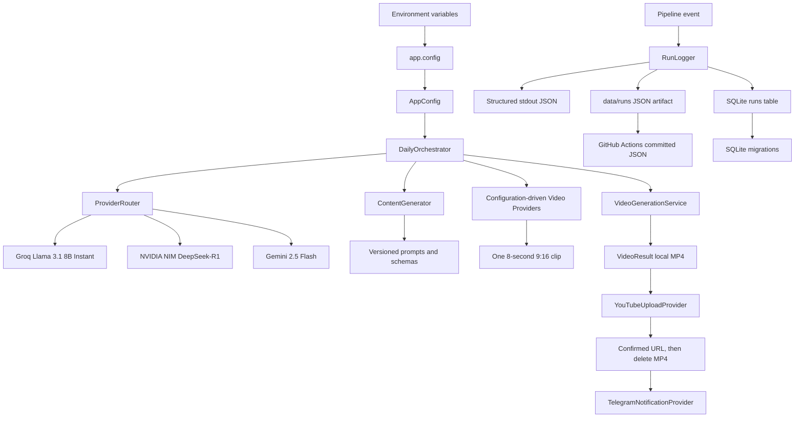

# Version 1 Production Architecture

## Module boundaries

- `app.config` validates environment-only configuration and never emits secrets.
- `app.exceptions` and `app.types` contain the typed, provider-neutral state.
- `app.storage` owns SQLite schema migrations and parameterized persistence.
- `app.logging` owns structured stdout events plus synchronized SQLite and JSON
  run-log writes.
- `app.main` validates configuration and exposes the `run` and one-time
  `youtube-auth` commands.
- `app.providers.base` defines narrow protocols for text, video, upload, and
  notification providers without importing a vendor SDK.
- `app.providers.router` owns health checks, priority selection, transient
  retry delegation, and provider-specific fallback.
- `app.content` owns topic/script prompt rendering, provider-neutral output
  validation, and typed content models. It invokes only the router.
- `app.content.factory` is the composition root for the Groq → NVIDIA → Gemini
  provider chain; adapters use injected HTTP transports in tests.
- `app.utils.retry` owns retry classification and configurable exponential
  backoff; `app.utils.jsonschema` validates provider output contracts.
- `app.providers.openrouter_video_provider` owns only OpenRouter's documented
  asynchronous Video API (create job, poll to completion, download MP4) and is
  the primary, configuration-selected video provider.
- `app.providers.veo_provider` owns the official Google long-running Veo
  operation as the single configuration-selected fallback, defaulting to the
  Veo 3.1 Lite preview tier. Every video adapter returns a runner-local MP4
  through `VideoGenerationService` without vendor knowledge in
  `app.orchestrator`.
- `app.video.factory` builds ordered video providers from JSON environment
  profiles. `app.orchestrator` receives only `VideoGenerationService`,
  `UploadProvider`, and `NotificationProvider` interfaces; it has no vendor
  provider or model knowledge.
- `app.providers.youtube_provider` owns resumable official YouTube Data API
  uploads and confirms the returned video ID before reporting success.
- `app.providers.telegram_provider` owns Telegram Bot API delivery without
  emitting credential-bearing data.
- `app.storage` owns typed, parameterized repositories for the four required
  SQLite tables.

The immutable SQLite migration creates all core tables from the specification
(`runs`, `artifacts`, `analytics`, and `provider_health`). Milestone 2 adds a
typed, parameterized repository for each table; the run logger remains the only
daily-pipeline caller until future milestones use the other repositories.
Future modules must add immutable migrations rather than changing the initial
schema.

## Automation and artifact lifecycle

The scheduled GitHub Actions workflow runs at 08:00 Asia/Kolkata and accepts a
manual dispatch. It uses the automatically provided Actions `GITHUB_TOKEN` with
`contents: write` only to commit successful JSON run artifacts; no personal
access token is used. It uploads logs for every execution, preserves an MP4 only
when publishing fails, and deletes the MP4 only after a confirmed YouTube upload.

## Verification status

The Version 1 pipeline is covered by mock-backed provider tests and a complete
pipeline integration test. `ruff`, `black --check`, and `pytest` run locally and
in GitHub Actions with Python 3.11.

## Deferred boundaries

Monthly analytics, a judge ensemble, multilingual publishing, captions, voice,
and prompt optimization remain outside Version 1.
