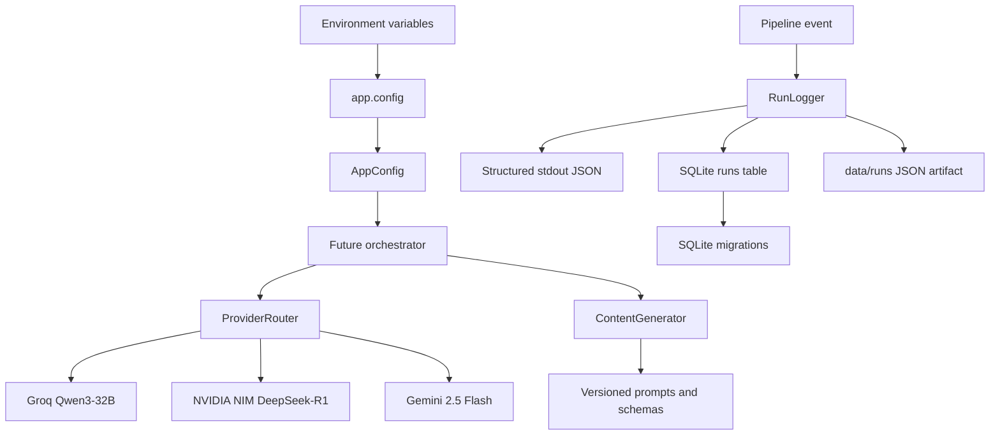

# Milestone 2 Architecture

## Module boundaries

- `app.config` validates environment-only configuration and never emits secrets.
- `app.exceptions` and `app.types` contain the typed, provider-neutral state.
- `app.storage` owns SQLite schema migrations and parameterized persistence.
- `app.logging` owns structured stdout events plus synchronized SQLite and JSON
  run-log writes.
- `app.main` validates configuration safely; it does not invoke providers.
- `app.providers.base` defines narrow protocols for text, video, upload, and
  notification providers without importing a vendor SDK.
- `app.providers.router` owns health checks, priority selection, transient
  retry delegation, and provider-specific fallback.
- `app.content` owns topic/script prompt rendering, provider-neutral output
  validation, and typed content models. It invokes only the router.
- `app.content.factory` is the composition root for the Groq → NVIDIA → Gemini
  provider chain; adapters use injected HTTP transports in tests.
- `app.utils.retry` owns retry classification and configurable exponential
  backoff; `app.utils.jsonschema` validates provider output contracts.
- `app.storage` owns typed, parameterized repositories for the four required
  SQLite tables.

The immutable SQLite migration creates all core tables from the specification
(`runs`, `artifacts`, `analytics`, and `provider_health`). Milestone 2 adds a
typed, parameterized repository for each table; the run logger remains the only
daily-pipeline caller until future milestones use the other repositories.
Future modules must add immutable migrations rather than changing the initial
schema.

## Verification status

Milestone 2 has passed its configured local quality gates: `ruff`,
`black --check`, and `pytest`. New core modules are measured at at least 90%
coverage with mock-only tests. The reusable GitHub Actions workflow executes
the quality gates with Python 3.11 for continuous, daily, monthly, and manual
validation events.

## Deferred boundaries

Video generation, uploads, notifications, analytics collection, and Git commits
are intentionally deferred to their named milestones. This preserves the
required one-responsibility boundaries and avoids guessing any third-party API
behavior.
